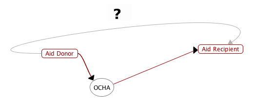

# Humanitarian Aid Transparency

This report forms a policy proposal for increasing the transparency of humanitarian financing. Our proposal expands on initiatives already undertaken by the UN Office for the Coordination of Humanitarian Affairs (OCHA), who committed to improving transparency as a result of a _Grand Bargain_ made by humanitarian organisations at the 2016 World Humanitarian Summit (WHS) in Istanbul [@AGENDAFORHUMANITY_WorldHumanitarianSummit_2016]. The WHS identified essential principles of transparency. However, we argue there is one principle they missed. Our proposal addresses that deficiency.

## Transparency

Transparency helps fight corruption because it provides the keys to understand: "why, how, what, and how much" [@TransparencyInternational_WhatCorruption_2018]. Evidence from the UK suggests that such transparency is necessary. The amount of humanitarian aid given by the UK is a result of the official development assistance target of 0.7% of gross national income [@GOV.UK_OfficialDevelopmentAssistance_2018]. In 2015, that amounted to the UK spending £12.1bn [@Morris_RealityCheckHow_2017], a degree of funding that has received much criticism. For example, while giving evidence to a U.S. Senate Committee on foreign relations, ex-UK Prime Minister David Cameron suggested that much of the money goes to corrupt regimes: "If what we do is just have continued programs for countries that sometimes fail year after year after year, we just keep going, maybe that’s not a good use of our money" [@MailOnline_Stripaidmoney_2018]. Since, as we've seen, clarity is a weapon against corruption, we believe it might be possible to address such objections by increasing the transparency of UK aid spending.

The question then is this: how to make humanitarian financing transparent? The WHS identified what they considered to be the _3Ts_ of transparency:

1. **Traceability** - the entire transaction chain of the data must be traceable.
2. **Totality** - the data must be complete and relevant.
3. **Timeliness** - the data should be up-to-date.

While we agree with the importance of those _3Ts_, we suggest that **trust** is important, too; after all, the information reported must be trustworthy. Thus, we propose transparent reporting of humanitarian aid financing through technology that is well-suited to meeting what we are calling the _4Ts_ of transparency. That technology is blockchain, which has inbuilt mechanisms for traceability, totality, timeliness and trust.

## Humanitarian Blockchain

We aim to provide a prototype of a blockchain-based system for disseminating information about humanitarian financing. The system will use the same foundations proposed by the _Grand Bargain_ made at the WHS, namely the data format developed by the International Aid Transparency Initiative (IATI) and OCHA's voluntary information reporting platform, the Financial Tracking Service (FTS) [@UNOfficefortheCoordinationofHumanitarian_Improvinghumanitariantransparency_2017]. The IATI will provide the schema for the aid funding information stored on the blockchain, and the FTS will serve as a template for the interface for storing that data.

## Barriers to Implementation

While the WHS recognise that OCHA's FTS needs enhancing [@UNOfficefortheCoordinationofHumanitarian_Improvinghumanitariantransparency_2017], we do not underestimate the scale of the challenge of implementing improvements through blockchain technology. Indeed the barriers to a blockchain-based implementation include:

1. **Technological**. For example, users of the platform will need software capable of digitally signing the information stored on the blockchain. Furthermore, blockchains are new, extremely complex, technology [@Coppi_Pensebetehumanitariansexploring_2018], whereas traditional databases have been around much longer and are, therefore, much better understood.
2. **Organisational**. Public blockchains are inherently non-hierarchical that cannot be controlled by any single entity [@Huckle_FakeNewsTechnological_2017]. However, the FTS is a reporting platform run by OCHA. Hence, a fully-public blockchain-based system may challenge centralised, top-down governance and related assumptions the UN have about reporting on their aid funding. Indeed, Figure 1. shows that, potentially, a blockchain-based system offers the possibility of direct aid funding that bypasses the UN altogether.
3. **Cost**.  New software may incur significant costs, including those required for development, training, maintenance, and infrastructure.

 

To overcome some of those hurdles, we propose a comparative analysis of outcomes through a test pilot program. That could involve a private UN blockchain, which might help address some of the organisational issues, and a public test blockchain, which would address some of the technological obstacles, and, perhaps, challenge those organisational concerns, too. Such a scheme would aid a greater understanding of the technology. It could also unearth other barriers. Finally, it might go some way to justifying (or not) the cost of a fully-operational system.

## Conclusion

We believe the use of blockchains to help improve the transparency of humanitarian financing would be novel; while organisations are researching the deployment of the technology to deliver help directly to those in need, there is very little research into how to use blockchains to advance the transparency of humanitarian aid at all levels. We aim to provide a prototype of just such a blockchain-based system. Through enhancing the IATI and FTS, the software we propose could be used to help further increase the accountability of humanitarian efforts. Ultimately, we hope the prototype software will form the basis of further research and lead to the deployment of a traceable, complete, timely and trustworthy aid reporting system that increases transparency and, thereby, helps the global fight against corruption.

## References
