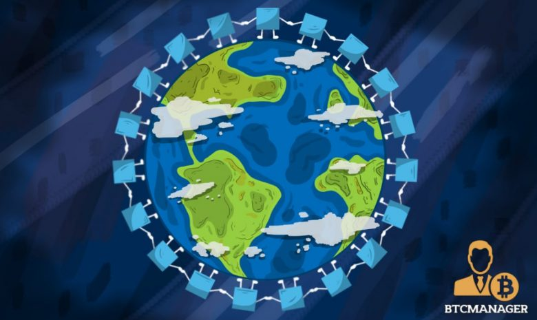

# Humanitarian Aid Reporting Through Blockchains

_Image Source: [BTCMANAGER](https://tinyurl.com/ybrxu6fa)_

by Steven Huckle, Tilemachos Chatziioannidis, Raul Araiza and Lara Llopis

- - -

## Corruption

_Image Source: [Daily Mail](https://tinyurl.com/y7eo44qk)_

## OCHA's Grand Bargain

_Image Source: [DABANGA](https://tinyurl.com/y8p6k2pd)_

## The 4Ts of Transparency

> + **Traceability**
> + **Totality**
> + **Timeliness**
> + **Trust**

## Blockchains

_Image Source: [Quora](https://tinyurl.com/ycengojn)_

## Humanitarian Blockchain

A prototype of a blockchain-based system for disseminating information about humanitarian financing.

## Barriers to implementation

> + **Technological**
> + **Organisational**
> + **Cost**
> + **Others?**

## Pilot

Comparative analysis of technology and outcomes:

> + Private UN (OCHA) blockchain
> + A public test blockchain

## Thank You

_Image Source: [BBC Sport](https://tinyurl.com/yaf5purj)_
