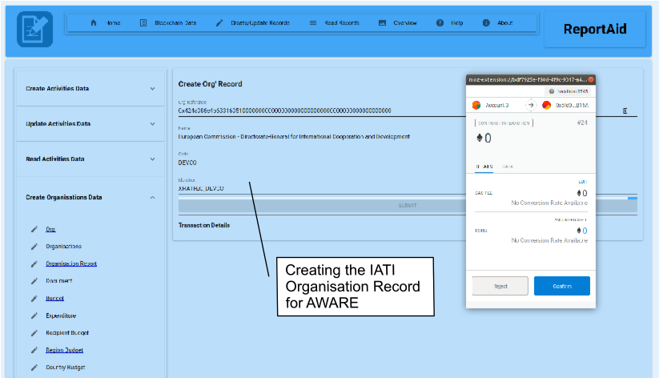
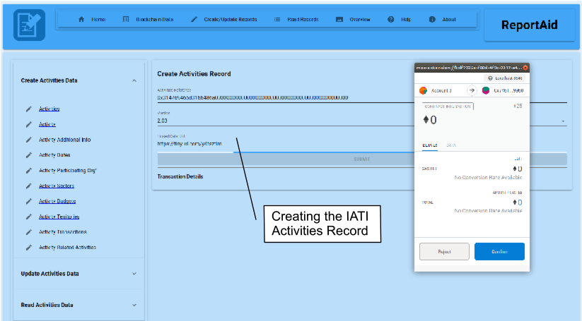
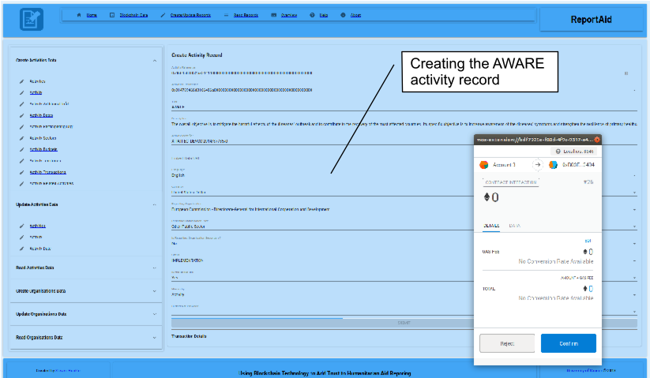
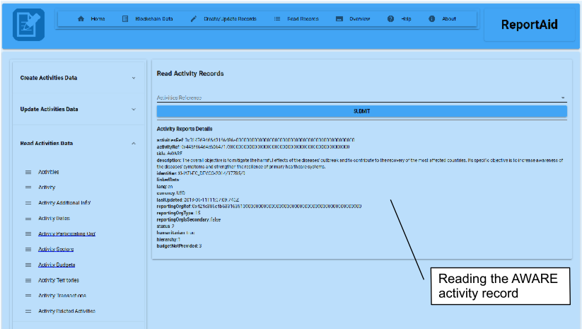
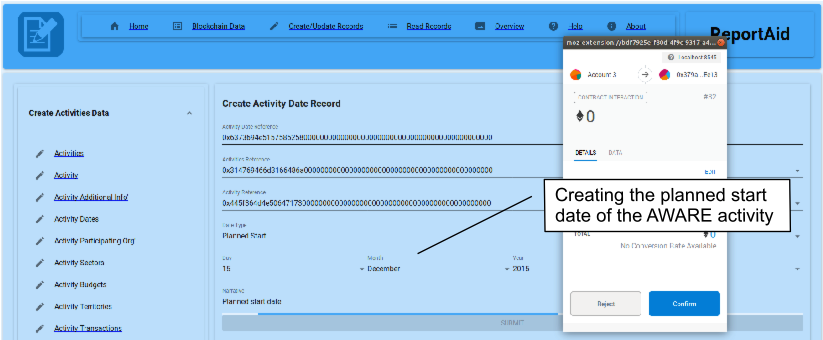
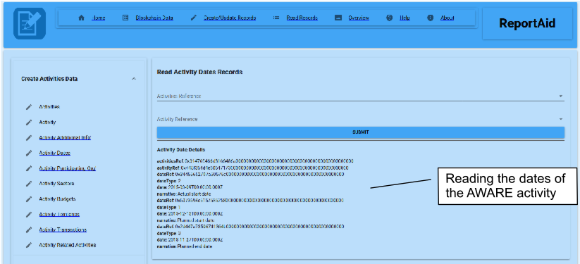
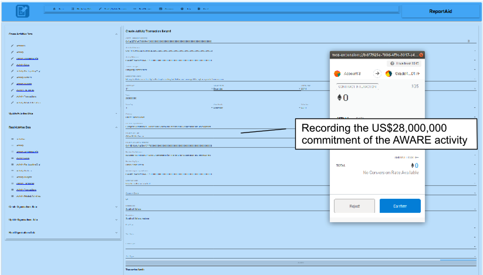
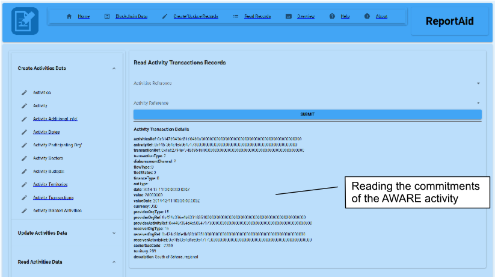

_Article_

Steve Huckle 1*

1 University of Sussex, Sussex House, Falmer, Brighton, BN1 9RH, United Kingdom

Correspondence: s.huckle@sussex.ac.uk; Tel.: +44 (0)1273 606755

Received: (date); Accepted: (date); Published: (date)

## Abstract

This article describes a blockchain-based application for increasing the transparency of humanitarian financing. At the 2016 World Humanitarian Summit in Istanbul, humanitarian organisations made a 'Grand Bargain' to publish timely and transparent information about their funding - the summit proposed meeting the requirements of that bargain through a financial tracking system that satisfied the _3Ts_ of transparency, namely traceability, totality and timeliness. Aid organisations have been investigating direct delivery of aid through blockchains. Still, there appears very little research, if any, into the use of blockchains to improve the transparency of their aid reporting. This paper fills that gap when discussing a prototype application that uses blockchains for aid reporting. It argues that blockchains include mechanisms ideally suited to meet the Grand Bargain's _3Ts_ while adding a fourth - trust. This paper describes the prototype by demonstrating its use to report on the European Commission's 2015 response to the Ebola crisis in West Africa. The hope is that, ultimately, this paper, and the software it describes, leads to the deployment of a blockchain-based humanitarian aid reporting system that helps the UN Office for the Coordination of Humanitarian Affairs increase the transparency of humanitarian aid.

**Keywords**: The International Aid Transparency Initiative, Blockchains, Ethereum, Humanitarian Aid, Trust

## Introduction

In her 2015 book about the promise of blockchain technology, Swan wrote that blockchains could usher in an era that revolutionises all aspects of society [@Swan_BlockchainBlueprintNew_2015]. She saw its potential for transforming not just the economy, but also political, social and scientific domains. She defined such potential as Blockchain 1.0, 2.0 and 3.0, where 1.0 represents cryptocurrencies, 2.0 represents financial applications, and 3.0 represents applications beyond finance. This paper examines a blockchain 3.0 application for humanitarian aid reporting, which is called [ReportAid](https://github.com/glowkeeper/ReportAid) [^1]. Coppi says, "few advanced use cases of blockchain exist in the humanitarian sector. Instead, much discussion relates to potential and anticipated uses of the technology" [@Coppi_BlockchainDistributedLedger_2019]. [ReportAid](https://github.com/glowkeeper/ReportAid) is a proof of concept that attempts to fill that gap.

First, this paper describes the trust capabilities of blockchains that make it ideally suited as a technology for reporting on charitable finance. Next, Ethereum is introduced, the particular blockchain technology used by [ReportAid](https://github.com/glowkeeper/ReportAid), the application that is the focus of this work. Then the paper introduces the International Aid Transparency Initiative, which is the United Nation's open standard for documenting mutual aid [@DevelopmentInitiatives_BaselineReportImplementing_2017]. Next, the paper focuses on the design of [ReportAid](https://github.com/glowkeeper/ReportAid), which is a blockchain implementation of that standard. Afterwards, the paper creates an imagined scenario where [ReportAid](https://github.com/glowkeeper/ReportAid) documents the European Commission's 2015 response to the Ebola crisis in West Africa. Finally, the paper analyses the benefits that blockchains bring to that imagined scenario before discussing the application's limitations and proposals for future work.

## Blockchains

The overarching purpose of a blockchain is to become a public asset ledger of everything ever recorded.

### Bitcoin

Blockchains came into being as the result of Satoshi Nakamoto's white paper on Bitcoin (BTC) [@Nakamoto_BitcoinPeertoPeerElectronic_2008], which raises the problem of legacy electronic cash systems that necessitate trusting many of the third-party financial institutions that had been at the centre of the 2008 financial crisis [@Nakamoto_BitcoinPeertoPeerElectronic_2008]. For example, supposedly irreversible payments may get reversed, which leads to expensive dispute mediation, a cost that limits the minimum size of transactions, making very small payments impractical. Moreover, fraud becomes endemic.

### Distributed and Peer-to-Peer

Bitcoin is a form of electronic cash that relies on a distributed peer-to-peer (P2P) network. It overcomes many of the problems inherent in legacy financial systems because it is _trustless_, in the sense that it decentralises authority because the network operates without needing to trust any single controlling entity or third-party financial institutions [@Nakamoto_BitcoinPeertoPeerElectronic_2008]. A P2P network, which is where all nodes have direct access to each other; those nodes are both service providers and service requesters [@Graham_FirstInternationalConference_2002]. A _decentralised_ system is where P2P nodes, which may be separated geographically, do not cede control to one individual or organisation. _Distributed_ describes a decentralised system that behaves as a single, coherent, logical entity. Bitcoin is just such a system because, although it is physically decentralised, it behaves as though it is logically centralised since users interact with it in a manner that is entirely consistent and uniform [@Tanenbaum_DistributedSystemsPrinciples_2007].

### Distributed Consensus

BTC achieves its trustless state through its consensus processes. In a distributed system that consists of many computing nodes, any of which could be unreliable, it is a challenge to reach an agreement, such that the system as a whole maintains consistency. It is a conundrum known as the Byzantine Generals Problem because an archaic battlefield analogy describes it succinctly. Loyal generals of the Byzantine army camped with their troops around an enemy city, must reach agreement on a battle strategy. Unfortunately, one or more of the generals are traitors that attempt to subvert the plan; under those circumstances, how do the loyal generals ensure the Byzantine effort is successful? The solution for distributed computing is to use a consensus protocol that is a global agreement between many, distrusting, anonymous parties [@AndrewPoelstra_StakeConsensus_2015], such that nodes on a distributed network can decide on a fault-tolerant state of the system. Byzantine Fault Tolerant (BFT) systems must be dependable, even under the circumstances where individual components have failed or where there is imperfect information available. Lamport gave a theoretical solution, via a distributed consensus scheme, in his 1982 paper [@leslie_lamport_byzantine_1982], where he shows that the problem is solvable if and only if more than two-thirds of the generals are loyal. However, Nakamoto's BTC implementation was the first computing application to provide production-ready BFT consensus.

### Mining

The BTC BFT consensus process is figuratively known as _mining_ because it is the process by which the system brings new coins into existence because nodes performing BFT consensus, known as _miners_, are rewarded with Bitcoin when they win the right to add blocks of transactions to the network. They win that right by solving a difficult cryptographic problem, a process called 'Proof of Work' (PoW) because the solution proves the node has performed computational effort [@bitcoin_wiki_proof_2015]. Furthermore, since PoW requires nodes on the BTC network to perform work to establish trusted identity, BTC naturally overcomes 'Sybil Attacks', which is where a single nefarious entity presents multiple identities to gain control of a substantial fraction of a system [@Douceur_SybilAttack_2002]. Finally, PoW solves the problem of double-spending in a distributed environment, so recipients can trust that someone else has not already spent their coins.

Bitcoin's basic unit of account is called a Satoshi, named in homage to the technology's creator. Satoshis represent one hundred millionth, or 0.00000001, of a single Bitcoin. Each BTC transaction has one or many inputs and one or more outputs, whereby each input maps the Satoshi paid to previous outputs, and each new output becomes an unspent transaction output (UTXO). Thus, the system functions as a transaction-based state transition system.

### Game Theory

Much of the theory behind PoW relies on a game-theoretic _Nash Equilibrium_, whereby the most profitable operation for each miner is to act in consensus with the majority. That works due to BTC's concept of the longest chain. If two versions of the next block on its blockchain are broadcast by different miners simultaneously, the network nodes verify a new block by accepting the earliest transaction. In that circumstance, the chain with the later transaction is reserved. When the next block is broadcast to the network, if the reserve chain becomes the longest branch, then the network nodes switch to that. In that case, the longest chain has expended the most significant amount of PoW, so as long as the majority of nodes on the network are honest, then the honest chain will grow faster than any competing chains. Hence, the majority decision on what constitutes an honest transaction is reached by consensus via the longest chain. Thus, the result is the system stabilises, since no participant gains by changing strategy from that which produces the longest chain [@AndrewPoelstra_StakeConsensus_2015].

### Block Immutability

The time stamping and hashing functions of miners help ensure the immutability of the BTC blockchain because block headers are hashes in a chain, and therefore an attacker must change all blocks in that chain to change a single block [@bitfury_group_public_2015]. As of 2014, only a computing array with the power of 1,753,694 PetaFLOPS could have had any chance of making a fake block on the BTC blockchain [@Harvey_BitcoinMythsFacts_2014]; a significantly more capable machine would be needed now. In 2014, the world's fastest supercomputer, the Chinese Tianhe–2, could manage 33.9 PetaFLOPS. That means that, in 2014, it would have taken over 50,000 Tianhe–2 supercomputers to attempt to create a fake block. Hence, there is practically no possibility of subverting Bitcoin's safety guarantee.

### The Blockchain as a Database

Greenspan describes the BTC blockchain as a distributed multi-version concurrency control (MVCC) database: "with a few more bells and whistles" [@greenspan_ending_2015]. At first glance, the comparison to a database appears valid. First, the current set of UTXO forms the whole database, whereby each UTXO equates to a single row in a table. Secondly, one or more of those outputs creates one or more new outputs, which is much like a database transaction that deletes one or more rows and then creates one or more new rows. Thirdly, blockchains ensure a single output cannot be spent by more than one transaction, much like MVCC databases guard against the deletion of a single row by more than one transaction. Fourthly, the unit inputs to a transaction must cover the unit outputs, a rule that disallows transactions from increasing the number of units on the network. That is similar to a database stored procedure, except that it is impossible to circumvent. Hence, perhaps the comparison is not so valid, after all, because a blockchain is different from a traditional distributed database as they are far more capabilities. For instance, as has been shown above, fundamental to blockchains are their consensus protocols that allow for the secure and seamless transfer of assets without relying upon any form of centralisation [@swan_blockchain:_2015]. Furthermore, blockchain technology use public-key cryptography to create UTXOs, which means, unlike any database, they include a publicly auditable UTXO permission scheme. Indeed, the cryptographic capabilities of blockchains result in inherent confidentiality, integrity, authenticity and validity mechanisms [@Huckle_FakeNewsTechnological_2017].

The inherent 'trust mechanisms' of blockchains [@TheEconomist_TrustMachine_2015] are properties desirable in all healthy relationships [@Fukuyama_TrustSocialVirtues_1996]. Indeed, it is blockchains' implementation of trust that [ReportAid](https://github.com/glowkeeper/ReportAid), the application discussed later (which is the focus of this paper), takes advantage.

## Ethereum

BTC is an open-source GitHub project [^2], and therefore, anyone is free to fork the code and create their implementation of its underlying blockchain technology. Indeed, since its launch in 2009, Bitcoin has spawned a group of alternative blockchains that use the same general approach. They have popularly became known as _altcoins_ [@guadamuz_blockchains_2015]; some of the more well-known examples are Litecoin, Ripple and Stellar. Perhaps the best known, however, is Ethereum, which was first proposed in a white paper by Vitalik Buterin [@ethereum_ethereum_2016]. The network went live on 30th July 2015.

### Smart Contracts

Similar to BTC, Ethereum is a state transition system. However, instead of UTXO, the Ethereum state is comprised of objects called _accounts_, whereby state transitions are direct transfers of value between those accounts [@ethereum_ethereum_2016]. There are two types of account within Ethereum, 1) contract accounts and 2) externally owned accounts. Ethereum has capabilities above and beyond Bitcoin because the platform enables Turing-complete application code, in the form of contract accounts that are blockchain addressable scripts that represent verifiable application logic [@Huckle_SocialismBlockchain_2016]. When contract accounts receive transactions, they activate their associated code, whereby they can read and write to the blockchain and send other messages to other contracts; hence, Ethereum refers to contract accounts as _smart contracts_. External accounts have no associated application code; instead they use public key cryptography to create and sign transactions that are sent either to other external accounts or to contract accounts.

The phrase 'smart contract' was first coined in 1994 by Nick Szabo [@Szabo_SmartContracts_1994]. Szabo considered a smart contract as an electronic transaction protocol that did not require trusted intermediaries for executing contractual arrangements, such as payments. Back then, Szabo considered some Point of Sale systems as having implemented limited smart contract functionality. Today, Ethereum's smart contracts represent promises to provide some predefined functionality.

In reality, most Ethereum smart contracts are not exceptionally smart! Aside from some elementary arithmetic and a tiny amount of logic, mostly they represent simple _set_ and _get_ operations. That is because users are charged to perform computations on the blockchain, so less code leads to less expensive execution. Also, there is a maximum cost to those computations, and any function exceeding that maximum fails. Given those conditions, it makes sense to keep smart contracts as simple as possible, which means moving as much application complexity as possible away from the blockchain. Indeed, that is the approach used by [ReportAid](https://github.com/glowkeeper/ReportAid), the application discussed later in this paper, which runs on Ethereum and uses smart contracts to record publicly auditable humanitarian aid records. Next, this paper discusses those records.

## The International Aid Transparency Initiative

The "Grand Bargain" (GB) made at the 2016 World Health Summit (WHS), committed to enhancing the transparency of humanitarian aid reporting [@WorldHumanitarianSummit_CommitmentsActionWorld_2016].

The amount of humanitarian financing contributed by the UK is a result of the official development assistance target of 0.7% of gross national income [@GOV.UK_OfficialDevelopmentAssistance_2018]. In 2015, that amounted to the UK spending £12.1bn [@Morris_RealityCheckHow_2017], a degree of funding that has received much criticism. For example, while giving evidence to a US Senate Committee on foreign relations, ex-UK Prime Minister David Cameron suggested that much of the money goes to corrupt regimes, "If what we do is just have continued programs for countries that sometimes fail year after year after year, we just keep going, maybe that's not a good use of our money" [@MailOnline_StripAidMoney_2018].

There have been efforts to address such criticisms. The WHS described five 'commitments to action', which outline the critical responsibilities for aid:

1. Uphold the norms that safeguard humanity by enhancing compliance and accountability to international law.
2. Implement a new approach to forced displacement so that no one is left behind.
3. Achieve gender equality and greater inclusivity.
4. Instead of replacing local systems, reinforce them so that, eventually, there is no need for aid.
5. Invest in humanity by diversifying the resource base and increasing cost-efficiency [@WorldHumanitarianSummit_CommitmentsActionWorld_2016].

The WHS described those five critical responsibilities as an 'Agenda for Humanity' [^3], whose aim was to transform the lives of 130 million people living in crisis-affected areas around the world  @WorldHumanitarianSummit_CommitmentsActionWorld_2016]. As a result, large humanitarian donors and aid organisations agreed to a "Grand Bargain" (GB) to improve the lives of people living in fragile situations because of crises [@WorldHumanitarianSummit_CommitmentsActionWorld_2016]. The GB made many commitments, including enhancing the transparency of mutual aid reporting, thereby strengthening accountability, helping decision-making and ultimately, improving the effectiveness of humanitarian efforts. The Inter-Agency Standing Committee (IASC), a forum that was founded by UN and non-UN humanitarian partners in 1992 to strengthen mutual assistance, formed a 'workstream' to carry out the GB's transparency commitment [^4]. The workstream's baseline report acknowledged that, while more information on aid funding had become available, there was still a need for more organisations to produce better quality humanitarian data [@DevelopmentInitiatives_BaselineReportImplementing_2017].

As a result of the workstream, the United Nation's adopted the International Aid Transparency Initiative (IATI) as its standard open-data format for documenting aid finance [@DevelopmentInitiatives_BaselineReportImplementing_2017]. Established in 2008, IATI became part of the movement for improving the reporting of charitable actions. Then, in 2013, various bodies of the United Nations (UN) began hosting IATI [@DevelopmentInitiatives_ImprovingHumanitarianTransparency_2017], after which it became the international framework for publishing open data on development cooperation and humanitarian assistance [@DevelopmentInitiatives_BaselineReportImplementing_2017]. Indeed, as of January 2017, over 500 humanitarian organisations are using IATI, including the governments of Japan, Sweden, the UK and the US, the European Commission's Humanitarian Aid and Civil Protection department, Oxfam, Save the Children, UNICEF and the World Food Programme [@DevelopmentInitiatives_ImprovingHumanitarianTransparency_2017].

The workstream also identified the Financial Tracking Service (FTS) of the UN Office for the Coordination of Humanitarian Affairs, as the humanitarian reporting platform where IATI data from different organisations, and various platforms, could be amalgamated and published for analysis by global actors [@DevelopmentInitiatives_ImprovingHumanitarianTransparency_2017]. The FTS came into being in 1992 as a result of a set of guiding principles for strengthening the coordination of humanitarian emergency assistance under UN General Assembly Resolution 46/182 [^5]. As of the end of 2016, three hundred and fifty humanitarian organisations reported financial information to FTS, including all significant government donors, all UN humanitarian agencies, Red Cross organisations, as well as 250 NGOs and private organisations [@DevelopmentInitiatives_ImprovingHumanitarianTransparency_2017]. FTS can import the latest versions of the IATI standard; thus IATI complements FTS by providing the technical publishing framework by which FTS can make available structured reports on aid efforts.

This paper examines whether blockchains have capabilities that can enhance the FTS and add further succour to the transparency initiative of the WHS. It does so through [ReportAid](https://github.com/glowkeeper/ReportAid), a blockchain-based application that implements IATA on the blockchain.

## Application Design

The IATI open data standard defines specific entities that need recording. Figure 1, below, shows [ReportAid](https://github.com/glowkeeper/ReportAid) as a blockchain-based application that allows users to input, amend, and read IATA standard organisation and activity records. Hence, [ReportAid](https://github.com/glowkeeper/ReportAid) is a blockchain-based proof of concept that represents an implementation of the FTS.

Figure 2, below, shows the [ReportAid](https://github.com/glowkeeper/ReportAid) smart contract implementation of the IATI organisations standard. That standard describes planned future budget information for aid funding [^6]. Described is a top-level IATIOrganisations element (this contains information such as the generation date of the report), which has at least one IATIOrganisation element (containing the report's language and currency type). That IATIOrganisation element links to other information describing the aid, such as the reporting organisation, associated country budgets and any supporting documentation.

Figure 3, below, shows the [ReportAid](https://github.com/glowkeeper/ReportAid) smart contract implementation of the IATI activities standard. A large number of fields describe IATI activities, and [ReportAid](https://github.com/glowkeeper/ReportAid), at the time of writing, has not implemented all of those; however, it does support all the mandatory fields, as well as one or two that are recommended [^7]. Figure 3 shows a top-level IATIActivies element (which contains information such as the generation date of the report). That features at least one IATIActivity element (containing information such as the default currency type and the degree to which the activity relates to humanitarian aid), which links to information such as the organisation participating in the activity, the sector and territory to which the activity belongs, as well as budgetary data. A single reporting organisation produces an activity report.

## The European Commission's West African Response to Ebola

The baseline report of the IASC GB transparency workstream cites the recent Ebola crises as an example of incomplete, inaccurate, inconsistent and often inaccessible information that impacted the humanitarian effort in the diseases' epicentre in West-Africa [@DevelopmentInitiatives_ImprovingHumanitarianTransparency_2017]. Indeed, the report says that the lack of an adequately planned response hindered attempts to alleviate the outbreak because, at the time, no donor, government or aid agency was able to gain an overarching overview of available resources. The suggestion is that, were all the Ebola humanitarian aid efforts documented using the IATI standard and published to the UN's FTS, organisations would have had a more accurate picture of what was needed, thus improving the effectiveness of their response.

Despite such shortcomings, many of the organisations that are already using IATI make information about their development contributions available through existing aid information portals; a widely-used example is an open-source platform called [d-portal](http://d-portal.org/) [^8]. That includes several IATI activities related to the world's response to the Ebola outbreak in West Africa. Hence, it contains data that [ReportAid](https://github.com/glowkeeper/ReportAid) can import, thereby demonstrating its suitability as a proof of concept for blockchain-based humanitarian aid reporting. One such activity documented on [d-portal](http://d-portal.org) was that carried out by the European Commission's Directorate-General for International Cooperation and Development (DEVCO), titled "A West African Response to Ebola" (AWARE), with IATI activity identifier XI-IATI-EC_DEVCO-2014/37785/0. That had a planned start date of 15th December 2015 and planned end date of 27th November 2018. The commitments of the activity totalled US$39,957,400. Its overall objective was to mitigate the harmful effects of the diseases' outbreak. Additionally, it was to contribute to the recovery of the most affected countries. Its specific purpose was to increase awareness of the diseases' symptoms and strengthen the resilience of primary healthcare systems. The Appendix includes the XML describing AWARE.

Figure 4, below, shows [ReportAid](https://github.com/glowkeeper/ReportAid) creating the organisation record for AWARE.  

The smart contract implementation of IATI Activities depends on a single top-level activities record. [ReportAid](https://github.com/glowkeeper/ReportAid) must create that before it can record any specific activity. Figure 5, below, shows [ReportAid](https://github.com/glowkeeper/ReportAid) using MetaMask to sign the transaction creating the necessary top-level activities record [^705].

Figure 6, below, shows [ReportAid](https://github.com/glowkeeper/ReportAid) signing the transaction creating the activity relating to AWARE.

Subsequently, anyone can read that activity record. Furthermore, that data can be trusted because the transaction that created that record was digitally signed. Figure 7, below, shows [ReportAid](https://github.com/glowkeeper/ReportAid) retrieving the information created in Figure 6.

The AWARE activity had a planned start date of 15th December 2015, an actual start date of 9th March 2015 and a planned end date of 27th November 2018. Figure 8, below, shows [ReportAid](https://github.com/glowkeeper/ReportAid) recording the planned start date.

Figure 9, below, shows [ReportAid](https://github.com/glowkeeper/ReportAid) subsequently retrieving those dates.

Figure 10, below, shows [ReportAid](https://github.com/glowkeeper/ReportAid) recording AWARE's budget commitment of  US$28,000,000.

Figure 11, below, shows [ReportAid](https://github.com/glowkeeper/ReportAid) subsequently retrieving that record.

The AWARE activity recorded on [d-portal](http://d-portal.org) contains more information, such as other budgetary disbursements, administrative contact information and links to other activities related to AWARE. At the time of writing, [ReportAid](https://github.com/glowkeeper/ReportAid) was able to model most of that data, however showing that here would add little to the discussion.

## Discussion

The example above, which shows [ReportAid](https://github.com/glowkeeper/ReportAid) recording the European Commission's 2015 response to the Ebola crisis in West Africa, suggests blockchains, through implementing the IATI standard, can address criticisms of humanitarian aid, such as those made by ex-UK Prime Minister David Cameron while giving evidence to a US Senate Committee on foreign relations [@MailOnline_StripAidMoney_2018].

Even before the Grand Bargain made at the 2016 World Health Summit, the Inter-Agency Standing Committee, a forum that was founded by UN and non-UN humanitarian partners in 1992 to strengthen mutual assistance, had formed a Humanitarian Financing Task Team [^9], tasked with researching financial transparency. They believed that helped fight corruption by providing the keys to understand, "why, how, what, and how much" [@TransparencyInternational_WhatCorruption_2018]. The Humanitarian Financing Task Team defined the '3Ts' of transparent reporting:

1. **Traceability**. The entire transaction chain of aid data must be traceable.
2. **Totality**. Financial information must be complete and relevant.
3. **Timeliness**. Aid information should be up-to-date [@DevelopmentInitiatives_ImprovingHumanitarianTransparency_2017].

The mechanisms of blockchains, described earlier, address those '3Ts' of transparent reporting. First, blockchains satisfy the traceability criteria because its records are publicly viewable and all transactions created are traceable algorithmically [@Savelyev_CopyrightBlockchainEra_2018]. Secondly, they meet the totality criteria because its records are practically impossible to change and the present state of the blockchain is a deterministic function of the genesis block and its ensuing transaction history [@Ethereum_ShardingFAQs_2018]. In other words, a blockchain represents a historical record of all transactions ever recorded on their network. Thirdly, they fulfil the timeliness criteria because all records are timestamped. Therefore, anyone viewing the records can see just how timely they are.

However, might they have missed a 'T', namely, trust? Trust is the glue binding society together because it gives us confidence in situations that might otherwise harbour unknown risks [@Botsman_WhoCanYou_2018]. Society does not necessarily achieve prosperity as the result of an abundance of natural resources or brilliance of intellect. Neither is that an inevitable result of systemic ideologies, such as frictionless free markets or the communitarian approach of commons-based peer production. Those things may have an important role to play, but ultimately, prosperity, in any form, comes as a result of "spontaneous sociability", achieved through trust because that is the crucial ingredient of any relationship and healthy relationships lead to success [@Fukuyama_TrustSocialVirtues_1996]. As was shown above, a blockchain's decentralised exchange mechanisms go above and beyond a traditional distributed database because they use public-key cryptography to create records, which means, unlike any database, they include a publicly auditable permission scheme. Blockchains have capabilities resulting in their suitability for determining integrity and authenticity because they are a cryptographically secured immutable database technology with: "with a few more bells and whistles" [@greenspan_ending_2015].  In essence, blockchains have inbuilt trust mechanisms [@Huckle_FakeNewsTechnological_2017]. Hence, [ReportAid](https://github.com/glowkeeper/ReportAid) is an example of an application for humanitarian aid reporting that, by using blockchains, adds that vital ingredient of trust. For example, when an aid organisation adds a record to its implementation of the IATI standard, users can trust that it is that organisation that has created that record because they have digitally signed the transaction that did so.

## Limitations and Future Work

The WHS recognised that the FTS needed enhancing [@UNOfficefortheCoordinationofHumanitarian_ImprovingHumanitarianTransparency_2017], and this paper proposes [ReportAid](https://github.com/glowkeeper/ReportAid), as a blockchain implementation of IATI that adds trust to the traceability of humanitarian aid reporting, might be one such enhancement. However, there are significant barriers that might prevent the uptake of blockchain-based technology, such as [ReportAid](https://github.com/glowkeeper/ReportAid):

1. **Technological**. Aid organisations using [ReportAid](https://github.com/glowkeeper/ReportAid) would have to get used to new technology, whereas traditional databases have been around much longer and are, therefore, much better understood. There is likely to be pushback from IT departments too, because blockchains could, potentially, make them redundant.

2. **Organisational**. Public blockchains are inherently non-hierarchical, so they cannot be controlled by any single entity [@Huckle_FakeNewsTechnological_2017]. However, the FTS is a reporting platform run by the UN Office for the Coordination of Humanitarian Affairs. Hence, a fully-public blockchain-based system may challenge centralised, top-down governance and related assumptions the UN have about reporting on their aid funding.

3. **Cost**. Even though [ReportAid](https://github.com/glowkeeper/ReportAid) is a working prototype of a blockchain-based implementation of IATI, were there to be some investment in the technology, it may incur significant upfront costs, including those required for development, training and software maintenance. However, by replacing a traditional database architecture with a public blockchain, any organisation using blockchains may make significant long-term cost savings on infrastructure.

As well as barriers to uptake, the current version of [ReportAid](https://github.com/glowkeeper/ReportAid) is prototype software, so, at the time of writing, it is limited in several regards and therefore, future iterations of the application should address those limitations. For example, it has not yet implemented all of the IATI organisation and activity records, so its coverage of the IATI standard needs completing. [ReportAid](https://github.com/glowkeeper/ReportAid) only displays the very latest records for a particular organisation or activity; however, all iterations of that record exist on the blockchain so it could display those. Additionally, the reporting function of [ReportAid](https://github.com/glowkeeper/ReportAid) currently outputs text records to the screen. A future release of the application should output XML that conforms to the IATI standard.

## Conclusion

This paper discusses [ReportAid](https://github.com/glowkeeper/ReportAid), which is a blockchain-based application for implementing the IATI standard for humanitarian aid reporting. That paper gave some background to IATI and described the functionality of blockchains that make it an ideal tool for implementing that standard, which it showed by way of an imagined scenario where the application is used to document the European Commission's response to the Ebola outbreak in West Africa. That example shows how [ReportAid](https://github.com/glowkeeper/ReportAid) helps address criticism of humanitarian aid by providing the mechanisms for the _4Ts_ of transparent humanitarian aid reporting, namely:

1. **Traceability**
2. **Totality**
3. **Timeliness**
4. **Trustworthiness**

Finally, this paper proposes a test pilot of [ReportAid](https://github.com/glowkeeper/ReportAid). That might help address the technological obstacles and challenge organisational concerns, discussed above. A pilot scheme would also aid a greater understanding of the technology and should help unearth any additional hurdles to overcome. Were that to happen, [ReportAid](https://github.com/glowkeeper/ReportAid), as a unique and advanced humanitarian use-case of blockchains, would help realise some of Coppi's supposed potential of blockchain technology [@Coppi_BlockchainDistributedLedger_2019].

[^1]: the source code for ReportAid, as well as links to a working demonstration of the application, is available on GitHub at https://github.com/glowkeeper/ReportAid)
[^2]: Bitcoin's source code is available at https://github.com/bitcoin/bitcoin
[^3]: You can read more about the Agenda for Humanity at https://www.agendaforhumanity.org
[^4]: The IASC Grand Bargain Workstream is available at <https://interagencystandingcommittee.org/greater-transparency>
[^5]: UN General Assembly Resolution 46/182 is available at <http://www.un.org/documents/ga/res/46/a46r182.htm>
[^6]: What goes in an organisation file is described at https://iatistandard.org/en/guidance/preparing-data/organisation-information/what-goes-on-your-organisation-file/
[^7]: The activity information that must be published is described at <https://iatistandard.org/en/guidance/preparing-data/activity-information/activity-information-you-can-publish/>
[^8]: d-portal is available at <http://d-portal.org/>
[^9]: More information about the work of the Humanitarian Financing Task Team is available at <https://interagencystandingcommittee.org/humanitarian-financing-task-team>

## References

&nbsp;

##  Appendix: The AWARE XML

Below is the source XML modelled in Chapter 9.

<?xml version="1.0" encoding="UTF-8"?>
<iati-activities xmlns:iati-extra="http://datastore.iatistandard.org/ns">
  <iati-activity last-updated-datetime="2019-10-11T13:39:21" xml:lang="en" default-currency="EUR" humanitarian="0" hierarchy="1" generated-datetime="2019-10-11T12:53:35" version="2.02">
    <iati-identifier>XI-IATI-EC_DEVCO-2014/37785/0</iati-identifier>
    <reporting-org ref="XI-IATI-EC_DEVCO" type="15">
      <narrative xml:lang="en">European Commission - Development and Cooperation-EuropeAid</narrative>
    </reporting-org>
    <title>
      <narrative xml:lang="en">A West African Response to Ebola (AWARE)</narrative>
    </title>
    <description type="1">
      <narrative>The overall obj: to mitigate negative effects of the Ebola outbreak&contribute to the recovery of the most affected countries in West-Africa. The specific obj: to strengthen health systems to improve access to quality PHC, resilience&awareness.</narrative>
    </description>
    <participating-org ref="XI-IATI-EC_DEVCO" role="1" type="15" activity-id="XI-IATI-EC_DEVCO-2014/37785/0">
      <narrative xml:lang="en">European Commission - Directorate-General for International Cooperation and Development (DEVCO)</narrative>
    </participating-org>
    <participating-org ref="XI-IATI-EC_DEVCO" role="3" type="15" activity-id="XI-IATI-EC_DEVCO-2014/37785/0">
      <narrative xml:lang="en">European Commission - Directorate-General for International Cooperation and Development (DEVCO)</narrative>
    </participating-org>
    <participating-org ref="20000" role="2" activity-id="XI-IATI-EC_DEVCO-2014/37785/0">
      <narrative xml:lang="en">NON-GOVERNMENTAL ORGANISATIONS (NGOs) AND CIVIL SOCIETY</narrative>
    </participating-org>
    <participating-org ref="N/A" role="4" type="N/A" activity-id="XI-IATI-EC_DEVCO-2014/37785/0">
      <narrative xml:lang="en">NON-GOVERNMENTAL ORGANISATIONS (NGOs) AND CIVIL SOCIETY</narrative>
    </participating-org>
    <activity-status code="2"/>
    <activity-date iso-date="2015-12-15" type="1">
      <narrative xml:lang="en">Planned Start: 15-DEC-15</narrative>
    </activity-date>
    <activity-date iso-date="2015-03-09" type="2">
      <narrative xml:lang="en">Actual Start: 09-MAR-15</narrative>
    </activity-date>
    <activity-date iso-date="2018-11-27" type="3">
      <narrative xml:lang="en">Planned End: 27-NOV-18</narrative>
    </activity-date>
    <activity-date iso-date="2050-12-31" type="4">
      <narrative xml:lang="en">Actual End: 31-DEC-50</narrative>
    </activity-date>
    <contact-info>
      <organisation>
        <narrative xml:lang="en">Delegation of the European Union to Nigeria</narrative>
      </organisation>
      <department>
        <narrative xml:lang="en">Delegation of the European Union to Nigeria</narrative>
      </department>
      <telephone>+234 9-4617800</telephone>
      <email>delegation-nigeria@ec.europa.eu</email>
      <website>http://eeas.europa.eu/delegations/nigeria/index_en.htm</website>
    </contact-info>
    <activity-scope code="1"/>
    <recipient-region code="289" vocabulary="1">
      <narrative xml:lang="en">South of Sahara, regional</narrative>
    </recipient-region>
    <sector code="12250" vocabulary="1">
      <narrative xml:lang="en">Infectious disease control</narrative>
    </sector>
    <policy-marker code="01" significance="0" vocabulary="DAC">
      <narrative xml:lang="en">Gender Equality</narrative>
    </policy-marker>
    <policy-marker code="02" significance="0" vocabulary="DAC">
      <narrative xml:lang="en">Aid to Environment</narrative>
    </policy-marker>
    <policy-marker code="03" significance="0" vocabulary="DAC">
      <narrative xml:lang="en">Participatory Development/Good</narrative>
    </policy-marker>
    <policy-marker code="04" significance="0" vocabulary="DAC">
      <narrative xml:lang="en">Trade Development</narrative>
    </policy-marker>
    <policy-marker code="05" significance="0" vocabulary="DAC">
      <narrative xml:lang="en">Aid Targeting the Objectives of the Convention on Biological Diversity</narrative>
    </policy-marker>
    <policy-marker code="06" significance="0" vocabulary="DAC">
      <narrative xml:lang="en">Aid Targeting the Objectives of the Framework Convention on Climate Change - Mitigation</narrative>
    </policy-marker>
    <policy-marker code="07" significance="0" vocabulary="DAC">
      <narrative xml:lang="en">Aid Targeting the Objectives of the Framework Convention on Climate Change - Adaptation</narrative>
    </policy-marker>
    <policy-marker code="08" significance="0" vocabulary="DAC">
      <narrative xml:lang="en">Aid Targeting the Objectives of the Convention to Combat Desertification</narrative>
    </policy-marker>
    <policy-marker code="09" significance="0" vocabulary="DAC">
      <narrative xml:lang="en">Contributions To Reproductive, Maternal, Newborn and Child Health¿</narrative>
    </policy-marker>
    <collaboration-type code="1"/>
    <default-flow-type code="10"/>
    <default-finance-type code="110"/>
    <default-aid-type code="D02"/>
    <default-tied-status code="5"/>
    <budget type="1" status="2">
      <period-start iso-date="2020-01-01"/>
      <period-end iso-date="2020-12-31"/>
      <value currency="EUR" value-date="2019-10-11">0</value>
    </budget>
    <budget type="1" status="2">
      <period-start iso-date="2019-01-01"/>
      <period-end iso-date="2019-12-31"/>
      <value currency="EUR" value-date="2019-10-11">0</value>
    </budget>
    <planned-disbursement type="1">
      <period-start iso-date="20191900-01-01"/>
      <period-end iso-date="2017-12-01"/>
      <value currency="EUR" value-date="2019-10-11">150000</value>
      <provider-org provider-activity-id="XI-IATI-EC_DEVCO-2014/37785/0" type="15">
        <narrative>XI-IATI-EC_DEVCO</narrative>
      </provider-org>
      <receiver-org receiver-activity-id="XI-IATI-EC_DEVCO-2014/37785/0"/>
    </planned-disbursement>
    <planned-disbursement type="1">
      <period-start iso-date="20191900-01-01"/>
      <period-end iso-date="2017-12-01"/>
      <value currency="EUR" value-date="2019-10-11">150000</value>
      <provider-org provider-activity-id="XI-IATI-EC_DEVCO-2014/37785/0" type="15">
        <narrative>XI-IATI-EC_DEVCO</narrative>
      </provider-org>
      <receiver-org receiver-activity-id="XI-IATI-EC_DEVCO-2014/37785/0"/>
    </planned-disbursement>
    <planned-disbursement type="1">
      <period-start iso-date="20191900-01-01"/>
      <period-end iso-date="2017-12-01"/>
      <value currency="EUR" value-date="2019-10-11">150000</value>
      <provider-org provider-activity-id="XI-IATI-EC_DEVCO-2014/37785/0" type="15">
        <narrative>XI-IATI-EC_DEVCO</narrative>
      </provider-org>
      <receiver-org receiver-activity-id="XI-IATI-EC_DEVCO-2014/37785/0"/>
    </planned-disbursement>
    <planned-disbursement type="1">
      <period-start iso-date="20191900-01-01"/>
      <period-end iso-date="2017-12-01"/>
      <value currency="EUR" value-date="2019-10-11">150000</value>
      <provider-org provider-activity-id="XI-IATI-EC_DEVCO-2014/37785/0" type="15">
        <narrative>XI-IATI-EC_DEVCO</narrative>
      </provider-org>
      <receiver-org receiver-activity-id="XI-IATI-EC_DEVCO-2014/37785/0"/>
    </planned-disbursement>
    <capital-spend percentage="0"/>
    <transaction ref="XI-IATI-EC_DEVCO-2014/37785/0/0" humanitarian="0">
      <transaction-type code="2"/>
      <transaction-date iso-date="2014-12-11"/>
      <value currency="EUR" value-date="2019-10-11">28000000</value>
      <provider-org ref="XI-IATI-EC_DEVCO" provider-activity-id="XI-IATI-EC_DEVCO-2014/37785/0" type="15"/>
      <receiver-org>
        <narrative xml:lang="en"/>
      </receiver-org>
      <disbursement-channel code="2"/>
      <sector vocabulary="1" code="12250">
        <narrative xml:lang="en">Infectious disease control</narrative>
      </sector>
      <recipient-region code="289" vocabulary="1">
        <narrative xml:lang="en">South of Sahara, regional</narrative>
      </recipient-region>
      <tied-status code="5"/>
    </transaction>
    <related-activity ref="XI-IATI-EC_DEVCO-2015/358-184" type="2"/>
    <related-activity ref="XI-IATI-EC_DEVCO-2015/358-191" type="2"/>
    <related-activity ref="XI-IATI-EC_DEVCO-2015/358-224" type="2"/>
    <related-activity ref="XI-IATI-EC_DEVCO-2015/358-227" type="2"/>
    <related-activity ref="XI-IATI-EC_DEVCO-2015/358-232" type="2"/>
    <related-activity ref="XI-IATI-EC_DEVCO-2015/359-047" type="2"/>
    <related-activity ref="XI-IATI-EC_DEVCO-2015/363-727" type="2"/>
    <related-activity ref="XI-IATI-EC_DEVCO-2015/365-129" type="2"/>
    <related-activity ref="XI-IATI-EC_DEVCO-2015/369-334" type="2"/>
    <related-activity ref="XI-IATI-EC_DEVCO-2015/370-891" type="2"/>
    <related-activity ref="XI-IATI-EC_DEVCO-2015/370-908" type="2"/>
    <related-activity ref="XI-IATI-EC_DEVCO-2015/371-138" type="2"/>
    <related-activity ref="XI-IATI-EC_DEVCO-2015/371-573" type="2"/>
    <related-activity ref="XI-IATI-EC_DEVCO-2015/371-640" type="2"/>
    <related-activity ref="XI-IATI-EC_DEVCO-2015/371-653" type="2"/>
    <related-activity ref="XI-IATI-EC_DEVCO-2015/371-655" type="2"/>
    <related-activity ref="XI-IATI-EC_DEVCO-2015/371-880" type="2"/>
    <related-activity ref="XI-IATI-EC_DEVCO-2015/372-110" type="2"/>
    <related-activity ref="XI-IATI-EC_DEVCO-2018/398-579" type="2"/>
  </iati-activity>
</iati-activities>
